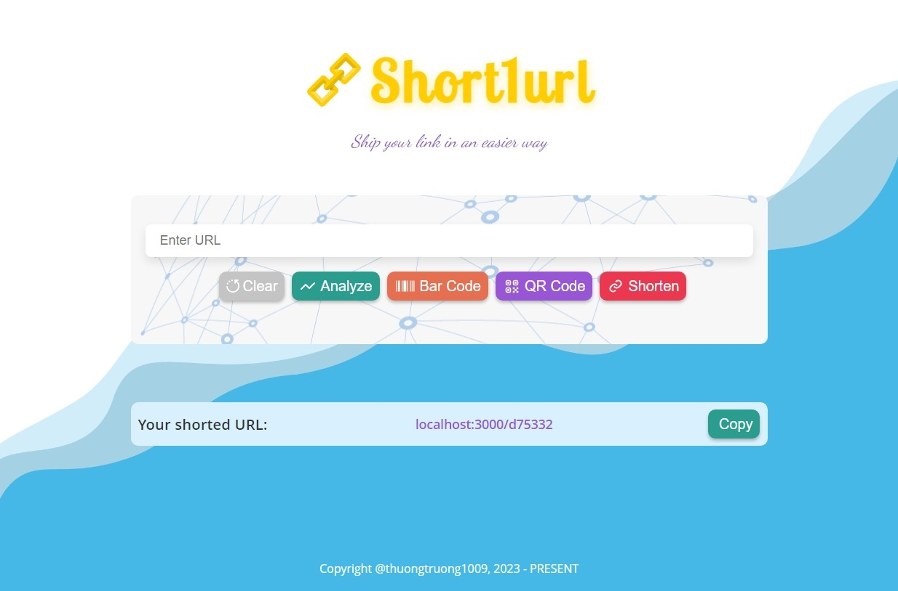
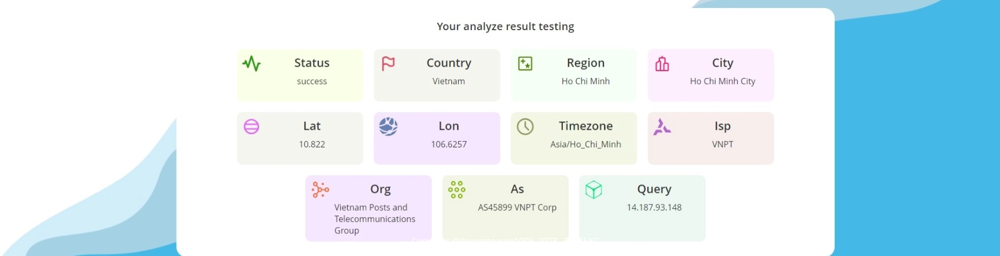

<div align="center">
    <!-- 
    
    
     -->
    <h1> SHORT1URL</h1>
</div>

## Introduction

This is a simple URL shortener service. It is written in Golang and uses Redis as database. Other hand, it also provides some services such as QR code generator, barcode generator, analyze network trafic, etc.

## Preview




## Features

- [x] Shorten URL
- [x] Redirect to original URL
- [x] Custom alias
- [x] Expiration time
- [x] Statistics
- [x] Rate limit
- [x] Analyze network traffic
- [x] QR code generator (custom color, download image)
- [x] Barcode generator
- [x] Dockerize
- [x] Auto build and push image
- [x] Deploy to Vercel (client)
- [x] Reverse proxy
- [ ] Unit test
- [ ] Caching

## Architecture


## How to run in local

1. Clone this repo

```bash
git clone https://github.com/thuongtruong1009/short1url.git
```

2. Run Docker container

```bash
docker-compose up -d
```

3. Fill in environment variables

```bash
# client
# Add your own API_URL
# Add your own IP_TRACKING_URL
cp .env.example .env

# server
# Add your own REDIS_URL
cp .env.example .env
```

3. Testing API

```bash
# with testing GUI (postman, hoppscotch, thunder client, etc)
POST http://localhost:3000/api
body: {
    "url": "<your_original_url>"
}

# with curl
curl -X POST 'http://localhost:3000/api'
     -H 'Content-Type: application/json'
     -d '{"url": "<your_original_url>"}"
```

<!-- ## References

[Ref1](https://liamhieuvu.com/url-shortener-with-golang-and-mysql)
[Barcode](https://fengyuanchen.github.io/vue-barcode/) -->
