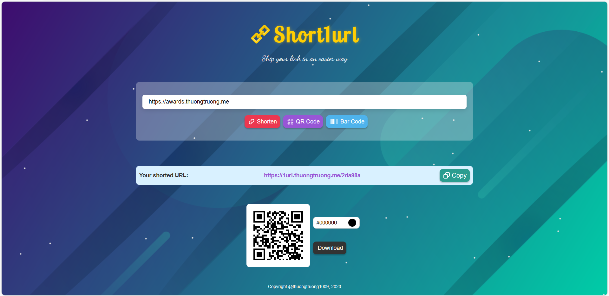

<div align="center">
    <h1> SHORT1URL</h1>
    
    
    
    <a href="https://github.com/thuongtruong1009/short1url/pkgs/container/short1url-api"></a>
    <a href="https://github.com/thuongtruong1009/short1url/pkgs/container/short1url-client"></a>
    
    <a href="https://github.com/thuongtruong1009/short1url/blob/main/LICENSE"></a>
    <a href="https://paypal.me/thuongtruong1009" rel="nofollow"></a>
     <!-- 
     -->
</div>

## Description

This is a simple URL shortener service. It is written in Golang and uses Redis as database. Other hand, it also provides some services such as QR code generator, barcode generator, etc.

## Preview



## What's new

- [x] Shorten URL
- [x] Redirect to original URL
- [x] Expiration time
- [x] Statistics
- [x] Rate limit
- [x] QR code generator (custom color, download image)
- [x] Barcode generator
- [x] Microservices Dockerize
- [x] Auto build and deploy image
- [x] Reverse proxy
- [ ] Unit test
- [ ] Caching

## Architecture


## Getting started

1. Clone this repo

```bash
git clone https://github.com/thuongtruong1009/short1url.git
```

2. Fill in environment variables

```bash
# client
cd api && cp .env.example .env

# server
cd client && cp .env.example .env
```

3. Run Docker container

```bash
docker-compose up -d
```

4. Testing API

```bash
# with browser
Open http://localhost:81/s
```

```bash
# with Postman or browser
POST http://localhost:81/s
body: {
    "url": "<your_original_url>"
}
```

```bash
# with curl
curl -X POST 'http://localhost:81/s'
     -H 'Content-Type: application/json'
     -d '{"url": "<your_original_url>"}"
```

## Contributing

Pull requests are welcome. For major changes, please open an issue first to discuss what you would like to change. If you like my work, please star 🌟 this repository.

## License

**Short1url** is an [MIT-licensed](LICENSE) open source project.

Copyright of <a href="https://github.com/thuongtruong1009">thuongtruong1009</a>

<!-- ## References

[Ref1](https://liamhieuvu.com/url-shortener-with-golang-and-mysql)
[Go on K8s](https://www.callicoder.com/deploy-multi-container-go-redis-app-kubernetes/)
[Nginx cache](https://vietnix.vn/cau-hinh-cache-nginx/)
[Nginx refs](https://github.dev/veryacademy/yt-nginx-mastery-series)
-->
