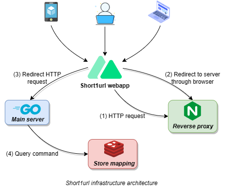

<div align="center">
    <h1> SHORT1URL</h1>
</div>



## How to run in local

1. Clone this repo

```bash
git clone https://github.com/thuongtruong1009/short1url.git
```

2. Run Docker container

```bash
docker-compose up -d
```

3. Testing API

```bash
# with testing GUI (postman, hoppscotch, thunder client, etc)
POST http://localhost:3000/api
body: {
    "url": "<your_original_url>"
}

# with curl
curl -X POST 'http://localhost:3000/api'
     -H 'Content-Type: application/json' 
     -d '{"url": "<your_original_url>"}"
```

## References

[Ref1](https://liamhieuvu.com/url-shortener-with-golang-and-mysql)